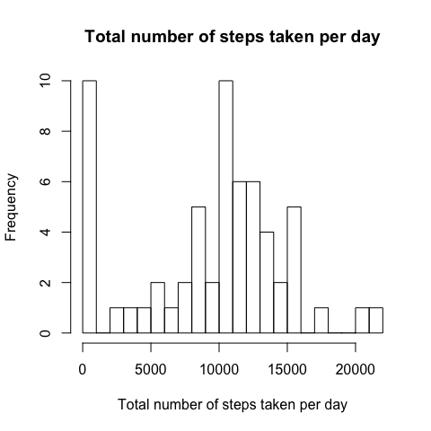
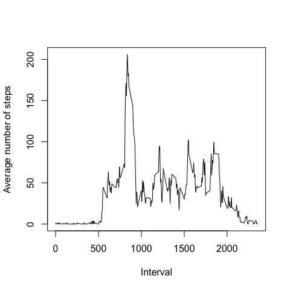
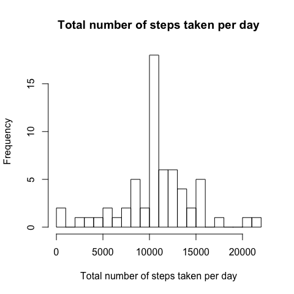
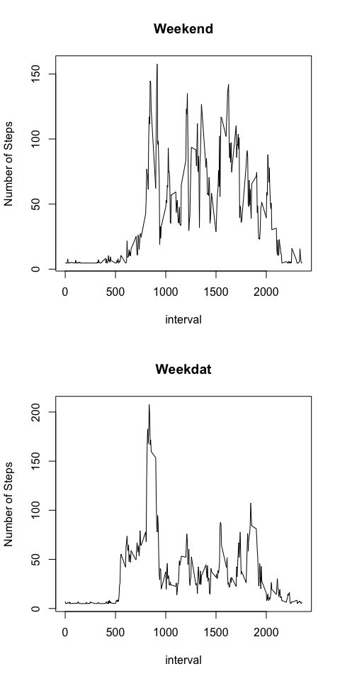

Reproducible Research: Peer Assessment 1
================

## Loading and preprocessing the data

``` r
library(Hmisc)
```

    ## Loading required package: lattice

    ## Warning: package 'lattice' was built under R version 3.6.2

    ## Loading required package: survival

    ## Warning: package 'survival' was built under R version 3.6.2

    ## Loading required package: Formula

    ## Loading required package: ggplot2

    ## Warning: package 'ggplot2' was built under R version 3.6.2

    ## 
    ## Attaching package: 'Hmisc'

    ## The following objects are masked from 'package:base':
    ## 
    ##     format.pval, units

``` r
library(dplyr)
```

    ## Warning: package 'dplyr' was built under R version 3.6.2

    ## 
    ## Attaching package: 'dplyr'

    ## The following objects are masked from 'package:Hmisc':
    ## 
    ##     src, summarize

    ## The following objects are masked from 'package:stats':
    ## 
    ##     filter, lag

    ## The following objects are masked from 'package:base':
    ## 
    ##     intersect, setdiff, setequal, union

``` r
library(ggplot2)
if(!file.exists('activity.csv')){
        link <- "https://d396qusza40orc.cloudfront.net/repdata%2Fdata%2Factivity.zip"
        download.file(link, "repdata%2Fdata%2Factivity.zip",method="curl")
        unzip("repdata%2Fdata%2Factivity.zip")
}

dat <- read.csv("activity.csv")
str(dat)
dim(dat)
dat$date <- as.Date(dat$date,"%Y-%m-%d")
```

## What is mean total number of steps taken per day?

``` r
step.sum <- as.matrix(with(dat,by(steps,date,sum,na.rm=T)))
hist(step.sum,breaks = 30, xlab="Total number of steps taken per day",main="Total number of steps taken per day")
```

<!-- -->

``` r
mean.step.sum <- round(mean(step.sum),2)
median.step.sum <- median(step.sum)
```

The mean and median of the total number of steps taken per day are
9354.23 and 10395

## What is the average daily activity pattern?

``` r
step.ave <- aggregate(dat$steps,list(dat$interval),mean,na.rm=T)
with(step.ave,plot(Group.1,x,type = "l",xlab="Interval",ylab="Average number of steps"))
```

<!-- -->

``` r
max.strp <- step.ave[which.max(step.ave$x),]
```

On average across all the days in the dataset, 835 contains the maximum
number of steps 206.17

## Imputing missing values

``` r
na.num <- sum(is.na(dat$steps))
dat.fill <- dat
dat.fill$steps <- impute(dat.fill$steps,mean)
step.sum.data.fill <- as.matrix(with(dat.fill,by(steps,date,sum,na.rm=T)))
hist(step.sum.data.fill,breaks = 30, xlab="Total number of steps taken per day",main="Total number of steps taken per day")
```

<!-- -->

``` r
mean.step.sum.data.fill <- round(mean(step.sum.data.fill),2)
median.step.sum.data.fill <- median(step.sum.data.fill)
```

\-The total number of missing values in the dataset is 2304.  
\-The mean and median total number of steps taken per day are
1.07661910^{4} and 1.076618910^{4} with the missing data filled in.
-Compared with the first part of the assignment, the mean and median
become
lager.

## Are there differences in activity patterns between weekdays and weekends?

``` r
weekday <- weekdays(dat.fill$date,abbreviate=T)
dat.fill$weekday <- "weekday"
dat.fill$weekday[weekday == "Sat" | weekday == "Sun"] <- "weekend"
table(dat.fill$weekday)
```

    ## 
    ## weekday weekend 
    ##   12960    4608

``` r
par(mfrow=c(2,1))
step.ave.data.fill <- aggregate(steps~weekday+interval,data=dat.fill, mean,na.rm=T)
with(step.ave.data.fill[step.ave.data.fill$weekday=="weekend",],plot(x=interval,y=steps,type = "l",xlab="interval",ylab="Number of Steps",main="Weekend"))
with(step.ave.data.fill[step.ave.data.fill$weekday=="weekday",],plot(x=interval,y=steps,type = "l",xlab="interval",ylab="Number of Steps",main="Weekdat"))
```

<!-- -->
